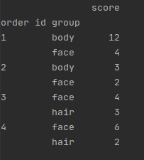

### Data Wrangler in Python

Pojawiła się potrzeba określania wiodącej grupy produktowej dla zamówień z produktami z wielu grup.
Wynik powinien zwracać zamówienia z przypisanymi nazwami najbardziej rentownej grupy produktowej.
Danych źródłowych nie można zmieniać. Zadanie rozwiąż w języku Python.

Potrzebne informacje:
* orderline - informacja o numerze zamówienia, klucz produktu na zamówieniu oraz liczba produktów
na zamówieniu
* products_dict - klucz produktu wraz z nazwą produktu i grupą produktową
* product_groups_priority - grupa produktowa wraz z przypisaną jej rentownością (1=najbardziej
rentowna grupa)

-------------------------------------------------

DANE ŹRÓDŁOWE:
```python
orderline_header = ('order_id', 'product_id', 'count')
orderline = \
    [(1, 1, 3),
     (1, 2, 1),
     (1, 3, 2),
     (2, 2, 1),
     (2, 3, 1),
     (3, 3, 1),
     (3, 4, 1),
     (3, 5, 3),
     (4, 3, 2),
     (4, 4, 1),
     (4, 5, 2)]


# product_id: [product_name, product_group]
products_dict = {1: ['Eveline Botanica', 'body'],
2: ['Ziaja jojoba', 'body'],
3: ['Soraya', 'face'],
4: ['Neutrogena hydro', 'face'],
5: ['Nivea hairmilk', 'hair']}


# product_group: score
product_groups_priority = {'body': 1, 'face': 2, 'hair': 3}
```

#### Wynik działania programu:


